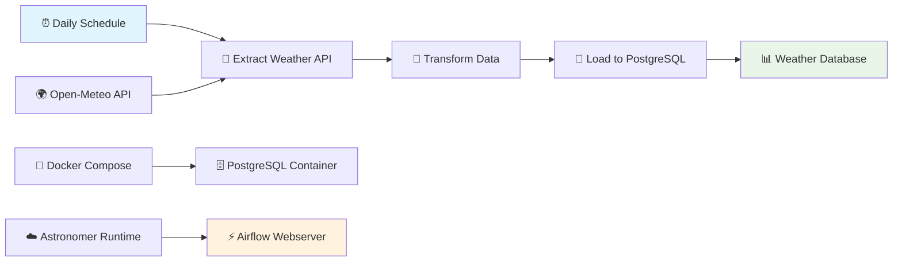

# 🌤️ Airflow Weather ETL Pipeline

> **Production-ready data engineering pipeline for real-time weather data processing**

[](https://airflow.apache.org/)
[](https://www.astronomer.io/)
[](https://www.postgresql.org/)
[](https://www.docker.com/)

## 🎯 Overview

A robust **ETL data pipeline** built with Apache Airflow that extracts real-time weather data from Open-Meteo API, transforms it for analysis, and loads it into PostgreSQL. Designed for **production deployment** with Astronomer Runtime and comprehensive testing.

## 📊 Pipeline Results


*Real-time weather data extracted and stored in PostgreSQL*

### ✨ Key Features

- **🔄 Automated ETL** - Daily scheduled weather data processing
- **🌐 API Integration** - Open-Meteo weather service with error handling
- **📊 Data Transformation** - Clean, structured weather metrics
- **💾 PostgreSQL Storage** - Persistent data warehouse with timestamps
- **🚀 Astronomer Runtime** - Enterprise-grade Airflow deployment
- **🧪 Testing Suite** - Comprehensive DAG validation and integrity checks

## 🏗️ Architecture



## 🛠️ Technical Stack

### **Data Engineering**
- **⚡ Apache Airflow** - Workflow orchestration and scheduling
- **☁️ Astronomer Runtime 3.0** - Enterprise Airflow distribution
- **🐍 Python TaskFlow API** - Modern, Pythonic DAG development
- **📡 HTTP Hooks** - Reliable API integration with connection management

### **Data Infrastructure**
- **🗄️ PostgreSQL** - Production-grade data warehouse
- **🐳 Docker Compose** - Containerized local development
- **🔗 Connection Management** - Secure credential handling
- **📊 Data Modeling** - Structured weather metrics schema

### **Location Focus**
- **📍 Dhaka, Bangladesh** - Latitude: 23.8103, Longitude: 90.4122
- **🌏 Local Weather Monitoring** - Regional climate data collection

## 🚀 Quick Start

### Prerequisites
- Docker & Docker Compose
- Astronomer CLI (optional for cloud deployment)

### Local Setup

```bash
# Clone repository
git clone https://github.com/Bayzid03/airflow-weather-etl.git
cd airflow-weather-etl

# Start PostgreSQL
docker-compose up -d postgres

# Install Astronomer CLI and start Airflow
astro dev start
```

Access Airflow UI at `http://localhost:8080`

### Production Deployment

```bash
# Deploy to Astronomer Cloud
astro deploy
```

## 📁 Project Structure

```
airflow-weather-etl/
├── dags/
│   ├── etlweather.py          # Main ETL pipeline DAG
│   └── exampledag.py          # Example astronaut data DAG
├── tests/
│   └── dags/test_dag_example.py  # DAG validation tests
├── docker-compose.yml         # PostgreSQL container setup
├── Dockerfile                 # Astronomer Runtime base
└── requirements.txt          # Python dependencies
```

## 🔧 Pipeline Details

### **Extract Phase**
```python
# Weather API extraction with error handling
endpoint = f'/v1/forecast?latitude={LATITUDE}&longitude={LONGITUDE}&current_weather=true'
response = http_hook.run(endpoint)
```

### **Transform Phase**
```python
# Data transformation and structuring
transformed_data = {
    'latitude': LATITUDE,
    'longitude': LONGITUDE,
    'temperature': current_weather['temperature'],
    'windspeed': current_weather['windspeed'],
    'winddirection': current_weather['winddirection'],
    'weathercode': current_weather['weathercode']
}
```

### **Load Phase**
```python
# PostgreSQL insertion with schema management
CREATE TABLE IF NOT EXISTS weather_data (
    latitude FLOAT, longitude FLOAT, temperature FLOAT,
    windspeed FLOAT, winddirection FLOAT, weathercode INT,
    timestamp TIMESTAMP DEFAULT CURRENT_TIMESTAMP
);
```

## 📊 Data Schema

| Column | Type | Description |
|--------|------|-------------|
| `latitude` | FLOAT | Geographic latitude |
| `longitude` | FLOAT | Geographic longitude |
| `temperature` | FLOAT | Current temperature (°C) |
| `windspeed` | FLOAT | Wind speed (km/h) |
| `winddirection` | FLOAT | Wind direction (degrees) |
| `weathercode` | INT | Weather condition code |
| `timestamp` | TIMESTAMP | Data collection time |

## 🎯 Production Features

- **⏰ Daily Scheduling** - Automated data collection at consistent intervals
- **🔄 Idempotent Operations** - Safe re-running with catchup disabled
- **🛡️ Error Handling** - Robust API failure management
- **📈 Monitoring** - Airflow UI for pipeline observability
- **🧪 Testing** - Comprehensive DAG validation suite

## 🧪 Testing

```bash
# Run DAG integrity tests
astro dev pytest tests/

# Validate DAG structure
python -m pytest tests/dags/test_dag_example.py
```

## 🌟 Future Enhancements

- [ ] **🌍 Multi-location Support** - Global weather data collection
- [ ] **📊 Data Visualization** - Grafana dashboards for weather trends
- [ ] **⚡ Real-time Streaming** - Apache Kafka integration
- [ ] **🤖 ML Integration** - Weather prediction models
- [ ] **📱 Alert System** - Weather condition notifications
- [ ] **☁️ Cloud Storage** - S3/GCS data lake integration

## 🤝 Contributing

Contributions welcome! Focus areas:
- **📊 Additional Data Sources** - More weather APIs and metrics
- **🔧 Pipeline Optimization** - Performance improvements
- **📈 Monitoring** - Advanced observability features
- **🧪 Testing** - Enhanced validation coverage

## 📄 License

MIT License - See [LICENSE](LICENSE) for details.

---

**Professional data engineering with enterprise-grade tools** 🚀📊
